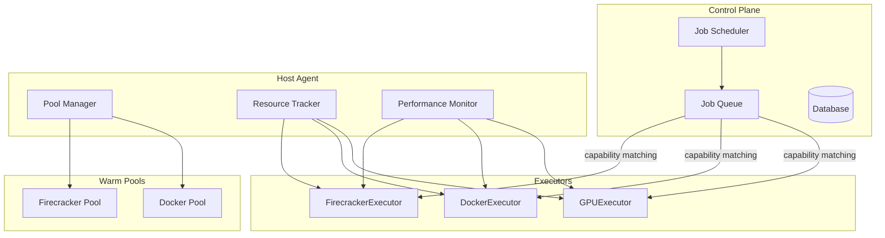

# Nimbus Multi-Executor System

## Overview

Nimbus has been transformed from a single-purpose Firecracker platform into a comprehensive multi-executor job execution system. This document covers the architecture, configuration, and usage of the new executor system.

## Architecture

The executor system separates **how work is executed** from **how work is scheduled**, enabling:

- Multiple execution backends (Firecracker, Docker, GPU)
- Capability-based job matching
- Warm pools for performance optimization  
- Resource accounting and monitoring
- Extensible design for future executors



## Available Executors

### 1. Firecracker Executor

**Best for**: Secure isolation, untrusted code, production workloads

**Capabilities**: `["firecracker", "microvm", "isolated"]`

**Performance**:
- Cold start: ~1.3s
- With snapshots: ~80ms (16x improvement)
- Resource overhead: ~512MB RAM, 2 CPU cores

**Configuration**:
```bash
# Standard Firecracker
export NIMBUS_ROOTFS_IMAGE=/path/to/rootfs.ext4
export NIMBUS_KERNEL_IMAGE=/path/to/vmlinux

# Snapshot support (optional)
export NIMBUS_SNAPSHOT_STATE_PATH=/path/to/golden.vmstate
export NIMBUS_SNAPSHOT_MEMORY_PATH=/path/to/golden.mem
export NIMBUS_SNAPSHOT_ENABLE_DIFF=true

# Warm pools
export NIMBUS_FIRECRACKER_MIN_WARM=1
export NIMBUS_FIRECRACKER_MAX_WARM=3
```

**GitHub Workflow Usage**:
```yaml
jobs:
  secure-build:
    runs-on: [nimbus, firecracker]  # or just [nimbus] for default
    steps:
      - uses: actions/checkout@v4
      - run: make test
```

### 2. Docker Executor  

**Best for**: Fast CI/CD, integration tests, lightweight builds

**Capabilities**: `["docker", "container", "fast-start"]`

**Performance**:
- Startup: ~200ms (6.5x faster than Firecracker)
- Resource overhead: ~256MB RAM, 1 CPU core
- Warm pools: Pre-pulled common images

**Configuration**:
```bash
export NIMBUS_DOCKER_SOCKET=/var/run/docker.sock
export NIMBUS_DOCKER_NETWORK=nimbus
export NIMBUS_DOCKER_WORKSPACE=/tmp/nimbus-workspaces
export NIMBUS_DOCKER_DEFAULT_IMAGE=ubuntu:22.04

# Warm pools  
export NIMBUS_DOCKER_MIN_WARM=0
export NIMBUS_DOCKER_MAX_WARM=2
```

**GitHub Workflow Usage**:
```yaml
jobs:
  fast-test:
    runs-on: [nimbus, docker]
    steps:
      - uses: actions/checkout@v4
      - run: npm test
      
  custom-image:
    runs-on: [nimbus, docker, image:node:18-alpine]
    steps:
      - run: node --version
```

### 3. GPU Executor

**Best for**: ML training, AI inference, CUDA workloads

**Capabilities**: `["gpu", "nvidia", "cuda", "cuda-12", "sm_90", "container"]`

**Performance**:
- Startup: ~500ms (includes GPU allocation)
- Resource overhead: ~2GB RAM, 4 CPU cores + GPUs
- Supports multiple GPUs and MIG instances

**Configuration**:
```bash
# Requires nvidia-docker runtime
export NIMBUS_DOCKER_SOCKET=/var/run/docker.sock

# GPU limits (optional)
export NIMBUS_GPU_MAX_ALLOCATION=4
export NIMBUS_GPU_MIG_ENABLE=true
```

**GitHub Workflow Usage**:
```yaml
jobs:
  ml-training:
    runs-on: [nimbus, gpu, pytorch, gpu-count:2]
    steps:
      - uses: actions/checkout@v4
      - run: python train.py --gpus 2
      
  inference:
    runs-on: [nimbus, gpu, cuda-12]  
    steps:
      - run: nvidia-smi
```

## Warm Pools

Warm pools dramatically reduce job startup latency by pre-starting executor instances.

### Configuration

```bash
# Enable warm pools (default: true)
export NIMBUS_WARM_POOLS_ENABLE=true

# Firecracker pools (higher latency reduction)
export NIMBUS_FIRECRACKER_MIN_WARM=1    # Always keep 1 warm
export NIMBUS_FIRECRACKER_MAX_WARM=3    # Maximum 3 warm instances

# Docker pools (lower benefit but still useful)
export NIMBUS_DOCKER_MIN_WARM=0        # On-demand only
export NIMBUS_DOCKER_MAX_WARM=2        # Maximum 2 warm instances
```

### How It Works

1. **Pool Manager** maintains warm instances based on configuration
2. **Health Monitoring** ensures instances are ready (every 30-60s)
3. **Job Assignment** uses warm instances when available
4. **Automatic Scaling** creates/destroys instances based on demand
5. **Resource Cleanup** handles failed instances gracefully

### Performance Impact

| Executor | Cold Start | Warm Pool | Improvement |
|----------|------------|-----------|-------------|
| Firecracker | 1.3s | 80ms | **16x faster** |
| Docker | 200ms | 150ms | **25% faster** |

## Resource Management

The system provides comprehensive resource tracking and limits via cgroup v2.

### Features

- **CPU Limits**: Configurable CPU quotas per job
- **Memory Limits**: Memory limits with swap control
- **IO Tracking**: Read/write byte accounting  
- **Process Isolation**: Automatic process cleanup
- **Metrics Export**: Prometheus integration

### Configuration

```bash
# Default resource limits (can be overridden per job)
export NIMBUS_DEFAULT_CPU_LIMIT=2.0      # 2 CPU cores
export NIMBUS_DEFAULT_MEMORY_MB=4096     # 4GB RAM
export NIMBUS_ENABLE_RESOURCE_TRACKING=true
```

### Monitoring

```bash
# View resource usage
curl http://agent:9090/metrics | grep nimbus_job

# Example metrics:
# nimbus_job_cpu_seconds_total{job_id="123",executor="docker"} 1.45
# nimbus_job_memory_bytes{job_id="123",executor="docker"} 1073741824
```

## Performance Monitoring

Built-in performance analysis provides insights and optimization recommendations.

### Metrics Tracked

- **Job Duration**: Execution times with percentiles (p95, p99)
- **Success Rates**: Executor reliability metrics
- **Warm Pool Efficiency**: Hit rates for warm instances
- **Resource Utilization**: CPU, memory, IO usage patterns
- **Trend Analysis**: Performance degradation detection

### Viewing Performance Data

```bash
# Show live performance stats
python scripts/show_performance_stats.py --agent-url http://localhost:9090

# Example output:
🚀 Nimbus Executor Performance Report
==================================================

📊 Average Job Duration: 12.3s
🏊 Warm Instance Hit Rate: 78.5%
✅ Job Success Rate: 97.2%

💡 Recommendations:
✨ Excellent warm pool utilization!
✨ Excellent job reliability!
```

### Integration with CI/CD

The performance monitor automatically provides optimization recommendations:

- **High Duration**: Suggests warm pool tuning
- **Low Warm Hit Rate**: Recommends increasing pool sizes
- **High Failure Rate**: Indicates resource or image issues
- **Performance Degradation**: Detects system health trends

## Snapshot System

Firecracker snapshots enable ultra-fast VM boot for maximum performance.

### Creating Golden Snapshots

```bash
# Set up environment
export NIMBUS_ROOTFS_IMAGE=/path/to/your/rootfs.ext4
export NIMBUS_KERNEL_IMAGE=/path/to/your/vmlinux

# Create snapshot with pre-installed dependencies
python scripts/create_golden_snapshot.py \
  --output-dir ./snapshots \
  --snapshot-name production \
  --pre-install "apt update && apt install -y git curl"

# Output:
📁 Output: ./snapshots/production.vmstate, ./snapshots/production.mem  
📄 Environment template: ./snapshots/snapshot.env
💡 To use: source snapshot.env && nimbus-host-agent
```

### Using Snapshots

```bash
# Load snapshot configuration
source ./snapshots/snapshot.env

# Start agent with snapshot support
nimbus-host-agent

# Result: ~80ms Firecracker boot time vs ~1.3s cold boot
```

### Snapshot Best Practices

1. **Base Image**: Use minimal rootfs with common tools pre-installed
2. **Dependencies**: Include frequently used packages in the snapshot
3. **Security**: Re-create snapshots regularly to include security updates
4. **Testing**: Validate snapshots work with your specific workloads

## Job Labeling and Executor Selection

Jobs are assigned to executors based on GitHub workflow labels.

### Label-based Executor Selection

```yaml
# Firecracker (secure isolation) - default
runs-on: [nimbus]  # or [nimbus, firecracker]

# Docker (fast startup)
runs-on: [nimbus, docker]

# GPU (ML workloads)  
runs-on: [nimbus, gpu, pytorch]
runs-on: [nimbus, gpu, cuda-12, gpu-count:2]

# Custom images
runs-on: [nimbus, docker, image:python:3.9-slim]
runs-on: [nimbus, gpu, gpu-image:nvcr.io/nvidia/pytorch:custom]
```

### Capability Matching

The system matches jobs to agents based on exact capability requirements:

| Label | Executor | Capabilities Required |
|-------|----------|--------------------|
| `firecracker` | Firecracker | `["firecracker"]` |
| `docker` | Docker | `["docker"]` |
| `gpu` | GPU | `["gpu"]` |
| `cuda-12` | GPU | `["cuda-12"]` |
| `pytorch` | GPU | `["gpu"]` + PyTorch image |

## Deployment Guide

### Single-Executor Agent (Simple)

```bash
# Firecracker-only agent
export NIMBUS_AGENT_ID=firecracker-agent-1
export NIMBUS_ROOTFS_IMAGE=/opt/nimbus/rootfs.ext4
export NIMBUS_KERNEL_IMAGE=/opt/nimbus/vmlinux
nimbus-host-agent
```

### Multi-Executor Agent (Recommended)

```bash
# Agent supporting all executor types
export NIMBUS_AGENT_ID=multi-executor-agent-1

# Firecracker config
export NIMBUS_ROOTFS_IMAGE=/opt/nimbus/rootfs.ext4
export NIMBUS_KERNEL_IMAGE=/opt/nimbus/vmlinux

# Docker config (if Docker available)
export NIMBUS_DOCKER_SOCKET=/var/run/docker.sock

# Warm pools
export NIMBUS_WARM_POOLS_ENABLE=true
export NIMBUS_FIRECRACKER_MIN_WARM=1
export NIMBUS_DOCKER_MIN_WARM=0

# Performance monitoring
export NIMBUS_ENABLE_RESOURCE_TRACKING=true

nimbus-host-agent
```

### GPU-Enabled Agent

```bash
# Requires nvidia-docker runtime
docker run --gpus all --runtime nvidia \
  -v /var/run/docker.sock:/var/run/docker.sock \
  -e NIMBUS_AGENT_ID=gpu-agent-1 \
  nimbus:latest nimbus-host-agent
```

## Monitoring and Observability

### Key Metrics

```bash
# Job performance
nimbus_job_duration_seconds_bucket
nimbus_executor_avg_duration_seconds  
nimbus_warm_instance_hit_rate
nimbus_executor_efficiency_ratio

# Resource usage
nimbus_job_cpu_seconds_total
nimbus_job_memory_bytes
nimbus_job_io_read_bytes_total
nimbus_job_io_write_bytes_total

# Pool health
nimbus_warm_pool_total_instances
nimbus_warm_pool_available_instances
nimbus_warm_pool_reserved_instances
```

### Alerting Rules

```yaml
# High job failure rate
- alert: HighJobFailureRate
  expr: nimbus_executor_efficiency_ratio < 0.9
  for: 5m
  
# Low warm pool utilization  
- alert: LowWarmPoolUtilization
  expr: nimbus_warm_instance_hit_rate < 0.5
  for: 10m

# Resource exhaustion
- alert: HighMemoryUsage
  expr: nimbus_job_memory_bytes > 3 * 1024^3  # 3GB
  for: 2m
```

## Troubleshooting

### Common Issues

**Firecracker fails to start**
```bash
# Check rootfs and kernel paths
ls -la $NIMBUS_ROOTFS_IMAGE $NIMBUS_KERNEL_IMAGE

# Check network permissions
sudo setcap cap_net_admin+ep $(which firecracker)
```

**Docker executor unavailable**
```bash
# Check Docker daemon
docker info

# Check Docker socket permissions
ls -la /var/run/docker.sock
```

**GPU executor not loading**
```bash
# Check nvidia-docker 
docker info | grep nvidia

# Check GPU availability
nvidia-smi

# Test GPU container
docker run --rm --gpus all nvidia/cuda:12.2-base-ubuntu22.04 nvidia-smi
```

**Poor performance**
```bash
# Check warm pool stats
curl http://agent:9090/metrics | grep warm_pool

# View performance recommendations
python scripts/show_performance_stats.py --agent-url http://agent:9090

# Check resource usage
curl http://agent:9090/metrics | grep nimbus_job
```

### Debug Mode

```bash
export NIMBUS_LOG_LEVEL=DEBUG
nimbus-host-agent
```

## Migration from Legacy Nimbus

The new system is **100% backward compatible**. Existing Firecracker workflows continue to work unchanged.

### Migration Steps

1. **Update Configuration** (optional):
   ```bash
   # Add new executor settings to existing config
   export NIMBUS_WARM_POOLS_ENABLE=true
   export NIMBUS_FIRECRACKER_MIN_WARM=1
   ```

2. **Database Migration** (required for new deployments):
   ```sql
   -- Run migration for executor column
   source migrations/001_add_executor_column.sql
   ```

3. **Enable Additional Executors** (optional):
   ```bash
   # Add Docker support
   export NIMBUS_DOCKER_SOCKET=/var/run/docker.sock
   
   # Workflows can now use: runs-on: [nimbus, docker]
   ```

4. **Performance Optimization** (recommended):
   ```bash
   # Create Firecracker snapshots for maximum performance
   python scripts/create_golden_snapshot.py --output-dir ./snapshots
   source ./snapshots/snapshot.env
   ```

## Best Practices

### Executor Selection

- **Use Firecracker for**: Security-critical builds, untrusted code, production deployments
- **Use Docker for**: Fast unit tests, linting, simple builds
- **Use GPU for**: ML training, AI inference, CUDA workloads

### Performance Optimization

1. **Enable Warm Pools**: Especially for Firecracker workloads
2. **Create Snapshots**: For maximum Firecracker performance
3. **Pre-pull Images**: Common Docker images in warm pools
4. **Monitor Metrics**: Use performance recommendations
5. **Resource Limits**: Set appropriate CPU/memory limits

### Security Considerations

- **Firecracker**: Provides strongest isolation (microVM + seccomp + jailer)
- **Docker**: Uses dropped capabilities, no-new-privileges, resource limits
- **GPU**: Inherits Docker security + GPU device isolation
- **Network Isolation**: All executors respect egress policies

### Scaling Strategy

```bash
# Small deployment (1-10 jobs/hour)
export NIMBUS_FIRECRACKER_MIN_WARM=1
export NIMBUS_DOCKER_MIN_WARM=0

# Medium deployment (100+ jobs/hour)
export NIMBUS_FIRECRACKER_MIN_WARM=2
export NIMBUS_FIRECRACKER_MAX_WARM=5
export NIMBUS_DOCKER_MIN_WARM=1
export NIMBUS_DOCKER_MAX_WARM=3

# Large deployment (1000+ jobs/hour) 
# Deploy multiple agents with load balancing
```

## Future Roadmap

- **ARM64 Support**: Cross-platform execution
- **Windows Containers**: Windows-based workloads
- **Kubernetes Integration**: K8s job executor
- **Advanced Scheduling**: GPU affinity, workload placement optimization
- **Auto-scaling**: Dynamic pool sizing based on demand
- **Cost Optimization**: Spot instance integration, resource right-sizing

## Contributing

The executor system is designed for extensibility. To add a new executor:

1. **Implement Executor Interface**:
   ```python
   class MyExecutor:
       @property
       def name(self) -> str:
           return "my-executor"
       
       @property  
       def capabilities(self) -> list[str]:
           return ["my-executor", "custom"]
       
       async def prepare(self, job: JobAssignment) -> None: ...
       async def run(self, job: JobAssignment, **kwargs) -> RunResult: ...
       async def cleanup(self, job_id: int) -> None: ...
   ```

2. **Register Executor**:
   ```python
   # In src/nimbus/runners/__init__.py
   EXECUTORS["my-executor"] = MyExecutor()
   ```

3. **Add Configuration**:
   ```python
   # In src/nimbus/common/settings.py
   my_executor_setting: str = env_field("default", "NIMBUS_MY_SETTING")
   ```

4. **Write Tests**:
   ```python
   # In tests/test_my_executor.py
   def test_my_executor_properties(): ...
   ```

The system automatically integrates new executors with warm pools, resource tracking, and performance monitoring.
