# Nimbus Executor System Implementation Plan

## Phase 1: DockerExecutor + Enhanced Capability Scheduler (1-2 weeks)

### Goals
- Add Docker-based executor for faster job startup (~200ms vs 1.3s)
- Leverage existing guardian/egress logic and cache infrastructure
- Implement proper capability-based job scheduling

### Tasks

#### 1.1 DockerExecutor Implementation (3-4 days)
- [ ] Create `src/nimbus/runners/docker.py`
- [ ] Implement Docker API integration using `docker` Python client
- [ ] Reuse existing guardian/egress enforcement for container networking
- [ ] Bind-mount workspace and artifact cache directories
- [ ] Handle job metadata injection via environment variables
- [ ] Implement proper container cleanup and resource limits

#### 1.2 Container Image Management (2 days)
- [ ] Create base container images for common job types
- [ ] Integrate with existing Docker Layer Cache registry
- [ ] Add image provenance verification using cosign
- [ ] Support custom images via workflow configuration

#### 1.3 Enhanced Capability Matching (1-2 days)
- [ ] Improve queue scanning algorithm for better performance
- [ ] Add more sophisticated capability matching (e.g., `docker+gpu`)
- [ ] Implement job priority queues for different executor types
- [ ] Add metrics for capability matching efficiency

#### 1.4 Testing & Integration (2 days)
- [ ] Create comprehensive Docker executor tests
- [ ] Test with real GitHub workflows using `runs-on: [nimbus, docker]`
- [ ] Validate performance improvements and resource usage
- [ ] Update documentation and examples

### Success Criteria
- Docker jobs start in <200ms vs Firecracker's 1.3s
- Full compatibility with existing cache and network policies
- Agents can run both Firecracker and Docker jobs simultaneously
- No regression in existing Firecracker functionality

---

## Phase 2: Warm Pools & Snapshot Boot (2-3 weeks)

### Goals
- Implement warm VM pools to eliminate cold-start overhead
- Add Firecracker snapshot support for 80ms startup time
- Resource-aware scheduling and pool management

### Tasks

#### 2.1 Warm Pool Infrastructure (4-5 days)
- [ ] Create `src/nimbus/runners/pool_manager.py` for pool orchestration
- [ ] Add warm pool configuration to HostAgent settings
- [ ] Implement pre-warmed executor instances with lifecycle management
- [ ] Add pool health monitoring and automatic replacement
- [ ] Create pool sizing algorithms based on historical load

#### 2.2 Firecracker Snapshot Support (5-6 days)
- [ ] Complete snapshot boot implementation in `FirecrackerLauncher`
- [ ] Create CI pipeline for golden snapshot generation
- [ ] Add incremental snapshot updates for faster image changes
- [ ] Implement snapshot verification and attestation
- [ ] Handle snapshot migration and versioning

#### 2.3 Resource Accounting & Management (3-4 days)
- [ ] Wrap executors in cgroup v2 slices for resource tracking
- [ ] Add Prometheus metrics per executor type
- [ ] Implement resource-aware job placement algorithms
- [ ] Add overcommit protection and bin-packing logic
- [ ] Create resource usage dashboards

#### 2.4 Performance Optimization (2-3 days)
- [ ] Optimize network setup for warm pools
- [ ] Add intelligent pre-loading of common dependencies
- [ ] Implement connection pooling for external services
- [ ] Tune garbage collection and memory management

### Success Criteria
- Firecracker jobs start in <100ms with snapshots
- Warm pools maintain 95%+ readiness for immediate job assignment
- 3-5x improvement in overall job latency
- Resource utilization tracking with <5% overhead

---

## Phase 3: GPU Executor (nvidia-docker + MIG) (3 weeks)

### Goals
- Support GPU workloads with nvidia-container-runtime
- Implement Multi-Instance GPU (MIG) resource management
- Add sophisticated GPU scheduling and capability advertisement

### Tasks

#### 3.1 GPU Executor Foundation (5-6 days)
- [ ] Create `src/nimbus/runners/gpu.py` with nvidia-docker support
- [ ] Add GPU detection and capability enumeration
- [ ] Implement CUDA version compatibility checking
- [ ] Add GPU memory and compute capability tracking
- [ ] Create GPU-specific container image management

#### 3.2 MIG (Multi-Instance GPU) Support (4-5 days)
- [ ] Add MIG partition detection and management
- [ ] Implement MIG instance allocation and cleanup
- [ ] Add fine-grained GPU resource scheduling
- [ ] Support dynamic MIG reconfiguration
- [ ] Add MIG-aware health monitoring

#### 3.3 Advanced GPU Scheduling (3-4 days)
- [ ] Implement GPU affinity and placement policies
- [ ] Add GPU capability matching (e.g., `cuda-12`, `sm_90`, `tensor-cores`)
- [ ] Create GPU workload balancing across multiple devices
- [ ] Add GPU utilization-based scheduling decisions
- [ ] Implement GPU job preemption for priority workloads

#### 3.4 Monitoring & Observability (3-4 days)
- [ ] Add comprehensive GPU metrics collection
- [ ] Create GPU utilization and performance dashboards  
- [ ] Add GPU job profiling and resource usage tracking
- [ ] Implement GPU error detection and recovery
- [ ] Add cost optimization recommendations

#### 3.5 Integration & Testing (2-3 days)
- [ ] Test with real ML/AI workloads (PyTorch, TensorFlow)
- [ ] Validate CUDA compatibility across different versions
- [ ] Performance testing with mixed GPU/CPU workloads
- [ ] Add GPU-specific examples and documentation

### Success Criteria
- Support for A100, H100, and other modern GPUs
- Efficient MIG utilization with minimal overhead
- Automatic CUDA version detection and compatibility
- GPU jobs scheduled optimally based on requirements
- Full observability into GPU resource utilization

---

## Implementation Order & Dependencies

```mermaid
graph TD
    A[Phase 0: Executor Framework ✅] --> B[Phase 1: Docker Executor]
    B --> C[Phase 2: Warm Pools]
    B --> D[Phase 3: GPU Executor]
    C --> E[Phase 4: Production Hardening]
    D --> E
```

## Risk Mitigation

### Technical Risks
- **Docker security isolation**: Use user namespaces, seccomp, and AppArmor
- **Resource exhaustion**: Implement proper limits and monitoring
- **GPU driver compatibility**: Test across multiple CUDA versions
- **Snapshot corruption**: Add checksums and automated recovery

### Operational Risks
- **Migration complexity**: Maintain backward compatibility
- **Performance regression**: Comprehensive benchmarking at each phase
- **Resource contention**: Implement proper QoS and priority handling

## Success Metrics

### Performance
- **Job startup time**: <200ms (Docker), <100ms (Firecracker w/ snapshots)
- **Throughput**: 3-5x improvement in jobs/hour capacity
- **Resource efficiency**: >80% CPU/memory utilization in steady state

### Reliability  
- **Success rate**: >99.5% job completion rate
- **Recovery time**: <30s for executor failures
- **Resource leaks**: Zero long-term resource accumulation

### Observability
- **Metrics coverage**: 100% executor operations instrumented
- **Alert response**: <5min mean time to detection
- **Debugging**: Full traceability for job failures
